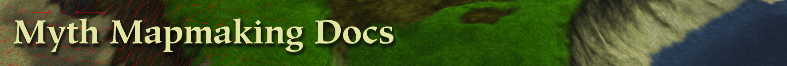

# { .masthead }

A collection of links, guides, documentation and useful information for mapmakers of the Myth series by Bungie.

* [Tags](tags.md)
* [Scripting (map actions)](scripting.md)
* [Sounds and Music](sounds.md)
* [Collections (graphics)](collections.md)
* [Models](models.md)

## Updates

* [Project Magma](https://projectmagma.net/){ target="_blank" } - Community developers of the Myth series

## Official Documentation

* [Loathing](https://projectmagma.net/downloads/myth2docs/loathing.html){ target="_blank" } - Bungie's mesh editor
* [Fear](https://projectmagma.net/downloads/myth2docs/fear.html){ target="_blank" } - Bungie's tag editor
* [Changelogs](https://github.com/jwheare/mythtooldocs/commits/main/){ target="_blank" } (github)

## Tools

* [Oak](https://projectmagma.net/~melekor/oak/){ target="_blank" } - Project Magma's editing suite
* [mythextract](https://github.com/jwheare/mythextract){ target="_blank" } - Command line tools for working with Myth tags (github)

## Overall Guides

* [Myth II Handbook](https://tain.totalcodex.net/items/show/the-myth-ii-handbook){ target="_blank" }
* [Killermac Mapmaking for Newbies Tutorial](http://www.orderofhpak.com/Manuals/Guides/Mapmaking%20for%20Newbies%20Tutorial.pdf){ target="_blank" } (pdf - OoH mirror)
* [Gangene Myth II Mapmaking Guide](https://web.archive.org/web/20001209122100fw_/http://people.atl.mediaone.net/gangrene/mapmake.htm){ target="_blank" } (archive.org - 2000-12-09)
* [Vista Cartel FAQ](https://web.archive.org/web/20021009220249fw_/http://vistacartel.com/myth/faq.html){ target="_blank" } (archive.org - 2002-10-09)
* [Jon God Oak guide](https://hl.udogs.net/files/Uploads/%20User%20Uploads/Jon%20God's%20Uploads/OakGuide/Oak%20guide.html){ target="_blank" }
* [Cydonian Map-Making Tutorials](https://hl.udogs.net/files/Gaming/%20Myth%20Series/Myth%20II%20-%20Soulblighter/Documents/Strategy/cydtips.html){ target="_blank" } (udogs archive)

## Tain Categories

* [Mapmaking Resources](https://tain.totalcodex.net/mythii/mapmaking_resources){ target="_blank" }
* [Tools](https://tain.totalcodex.net/mythii/tools){ target="_blank" }

## Community

* [:fontawesome-brands-discord:{ .discord } Project Magma - Myth Mapmaking Discord](https://discord.gg/Smuv2tk5f6){ target="_blank" }
* [The Tain: Forums](https://tain.totalcodex.net/forum/){ target="_blank" }
