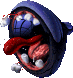

# Sound and music editing

## Myth II Sound Support Chart

[Original image version](sounds/M2_Sound_Chart.webp){ target="_blank" }

Requires 22,050 Hz 16 bit WAV/AIF format

|                               | Supports Mono | Supports Stereo | Ignores Pitch Values |
|-------------------------------|---------------|-----------------|----------------------|
| **Ambient Sound Sources[^1]** | ✅            | ❌              | ✅                   |
| **Ambient Sounds[^2]**        | ❌            | ✅              | ✅                   |
| **Postgame Win/Loss Sounds**  | ❌            | ✅              | ✅                   |
| **Main Menu Music**           | ✅            | ✅              | ❌                   |
| **Narration Sounds**          | ✅            | ✅              | ❌                   |
| **Unit Sounds (Attack/Move)** | ✅            | ⚠️[^3]          | ❌                   |

[^1]:
    Ambient **Sound Sources** are placed on a mesh using Loathing using this placeholder.

    

[^2]: Ambient **Sounds** are selected for a mesh using Fear or Oak.

[^3]: Unit Sounds support stereo but require a pitch double the original value. For some reason the game makes Stereo run half the speed of Mono.
